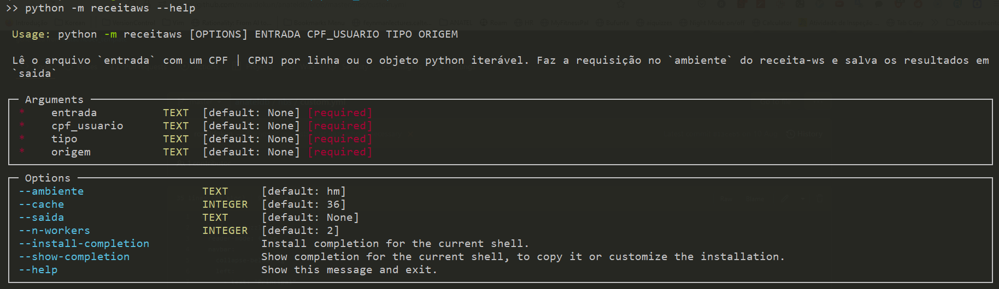

Receita-WS
================

<!-- WARNING: THIS FILE WAS AUTOGENERATED! DO NOT EDIT! -->

Para tal, ele acessa o serviço web [Receita
WS](https://anatel365.sharepoint.com/sites/WikiAnatel/SitePages/Web-Service--ReceitaWS-.aspx?OR=Teams-HL&CT=1660241010872&clickparams=eyJBcHBOYW1lIjoiVGVhbXMtRGVza3RvcCIsIkFwcFZlcnNpb24iOiIyNy8yMjA3MDMwMDgxNSIsIkhhc0ZlZGVyYXRlZFVzZXIiOmZhbHNlfQ%3D%3D)
desenvolvido na Anatel. Este por sua vez é um encapsulamento, com cache
em banco de dados corporativo, do Serviço Web
[Infoconv](https://acesso.infoconv.receita.fazenda.gov.br/docInfoconv/),
disponibilizado pela Serpro/Receita Federal, por meio de convênio
firmado com a Anatel.

## Instalação

### python

Caso não tenha o python instalado, baixe a versão para a sua plataforma
neste [link](https://www.python.org/downloads/) e siga as instruções.

? Alternativamente, para uma plataforma de desenvolvimento mais
versátil recomendamos que seja instalado o
[miniconda](https://docs.conda.io/en/latest/miniconda.html), que é uma
versão mínima do Anaconda.

? Para uma versão otimizada do *miniconda*, com excelentes *defaults*,
recomendamos ainda que seja instalado o
[miniforge](https://github.com/conda-forge/miniforge/releases),

### Ambiente Virtual

Primeiramente é recomendado a criação de ambiente virtual para instalar
o módulo, assim a versão python deste e suas dependências não afetam a
instalação do python padrão:

**Modo 1 - Utilizando o módulo venv (disponível em qualquer instalação
padrão do python3):**

``` bash
python -m venv <pasta>
```

Desse modo será criado o ambiente virtual na `<pasta>`

**Para ativar o ambiente virtual**:

**Windows**

Utilizando o Prompt de Comando: `cmd.exe`

    <pasta>\Scripts\activate.bat

Utilizando o `PowerShell`:

    <pasta>\Scripts\Activate.ps1

**Linux e MacOS**

    source <pasta>/bin/activate

**Modo 2 (Recomendado) - Utilizando o conda (disponível em qualquer uma
das instalações: `Anaconda | Miniconda | Miniforge`):**

    conda create -n <nome> python=3.10 -y

Desse modo será criado um ambiente virtual designado `<nome>` criado na
pasta interna do conda.

**Para ativar o ambiente virtual `conda`:**

``` bash
conda activate <nome>
```

Troque o comando `conda` por `mamba`, caso este tenha sido instalado

### Instalação do módulo `receitaws`

Com o ambiente virtual criado e ativado, em qualquer um dos modos
mostrados no parágrafo anterior, basta efetuar o comando:

    python -m pip install git+https://git.anatel.gov.br/rsilva/receitaws.git

> ? Como este é um serviço de uso exclusivo na rede interna da Anatel e
> por logins autorizados, a instalação é feita diretamente pelo
> repositório:

## Como utilizar

A presente biblioteca `receitaws` possui somente 1 módulo: `consultas`,
cuja API principal é a função
[`requisitar_em_lote`](https://ronaldokun.github.io/consultas.html#requisitar_em_lote):

### Script em linha de comando

A API principal `requisitar_em _lote` é exposta em linha de comando
chamando diretamente o módulo da seguinte maneira:

    python -m receitaws [OPTIONS] FILENAME CPF_USUARIO



### Dentro de outro módulo ou script python

``` python
from receitaws.consultas import requisitar_em_lote
```

------------------------------------------------------------------------

### requisitar_em_lote

>      requisitar_em_lote (entrada:str, cpf_usuario:str, tipo:str, origem:str,
>                          ambiente:str='hm', cache:int=36, saida:str=None,
>                          n_workers:int=2)

Lê o arquivo `entrada` com um CPF \| CPNJ por linha ou o objeto python
iterável. Faz a requisição no `ambiente` do receita-ws e salva os
resultados em `saida`

|             | **Type**      | **Default** | **Details**                                                                 |
|-------------|---------------|-------------|-----------------------------------------------------------------------------|
| entrada     | str           |             | Arquivo texto de entrada: 1 CPF \| CNPJ por linha ou objeto python iterável |
| cpf_usuario | str           |             | CPF do usuário requisitante                                                 |
| tipo        | str           |             | Tipo de Requisição CPF \| CNPJ                                              |
| origem      | str           |             | Texto com identificação da requisição: e.g. ‘Teste’                         |
| ambiente    | str           | hm          | Ambiente onde realizar a requisição: hm \| pd                               |
| cache       | int           | 36          | Tempo de expiração do cache em meses                                        |
| saida       | str           | None        | Arquivo de saída da requisição                                              |
| n_workers   | int           | 2           | Número de requisições a serem efetuadas em paralelo                         |
| **Returns** | **DataFrame** |             |                                                                             |

**Parâmetros obrigatórios:**

-   `entrada`: Arquivo texto de entrada: 1 CPF \| CNPJ por linha OU
    objeto python iterável
-   `cpf_usuario`: CPF do usuário requisitante
-   `tipo`: Tipo de Requisição CPF \| CNPJ
-   `origem`: Texto com identificação da requisição: e.g. ‘Teste’

``` python
cpf = CPF()
cpf_usuario = cpf.generate()
```

> ?? Como arquivo de entrada é esperado um arquivo *texto*,
> e.g. `csv | txt | tsv etc...` com 1 registro por linha!

``` python
requisitar_em_lote(entrada=r'D:\Code\receitaws\dados\cpf.csv', 
                     cpf_usuario=cpf_usuario,
                     tipo='cpf',
                     origem='Teste HM',
                     ambiente='hm',
                     cache=3,
                     saida=r'D:\Code\receitaws\dados\resultados_cpf_hm.csv')
```

<div>
<style scoped>
    .dataframe tbody tr th:only-of-type {
        vertical-align: middle;
    }

    .dataframe tbody tr th {
        vertical-align: top;
    }

    .dataframe thead th {
        text-align: right;
    }
</style>
<table border="1" class="dataframe">
  <thead>
    <tr style="text-align: right;">
      <th></th>
      <th>cpf</th>
      <th>nome</th>
      <th>situacaoCadastral.codigo</th>
      <th>situacaoCadastral.valor</th>
      <th>paisResidencia.residenteExterior</th>
      <th>paisResidencia.codigoPais</th>
      <th>nomeMae</th>
      <th>dataNascimento</th>
      <th>sexo.codigo</th>
      <th>sexo.valor</th>
      <th>...</th>
      <th>telefone.numero</th>
      <th>unidadeAdministrativaCodigo</th>
      <th>anoObito</th>
      <th>estrangeiro</th>
      <th>tituloEleitor</th>
      <th>dataAtualizacao</th>
      <th>dataRegistroAnatel</th>
      <th>resultado</th>
      <th>erro</th>
      <th>ocupacao.naturezaOcupacaoDescricao</th>
    </tr>
  </thead>
  <tbody>
    <tr>
      <th>0</th>
      <td>33481695268</td>
      <td>Ls Ifmqinlkurrssezna</td>
      <td>2</td>
      <td>Suspensa</td>
      <td>True</td>
      <td>0</td>
      <td>Cqyqxgqgumqinlkurrssezna</td>
      <td>1997-09-12</td>
      <td>1</td>
      <td>Masculino</td>
      <td>...</td>
      <td>97219728</td>
      <td>7439828</td>
      <td>0</td>
      <td>False</td>
      <td>0000000000000</td>
      <td>1937-04-06</td>
      <td>2022-09-27</td>
      <td>CPF encontrado</td>
      <td></td>
      <td>NaN</td>
    </tr>
    <tr>
      <th>1</th>
      <td>47819847034</td>
      <td>Tuxktnciwueq Koithctjx</td>
      <td>0</td>
      <td>Regular</td>
      <td>True</td>
      <td>0</td>
      <td>Abpcgqu Koithctjx</td>
      <td>1980-01-13</td>
      <td>9</td>
      <td>Sem informacao</td>
      <td>...</td>
      <td>15966520</td>
      <td>6976220</td>
      <td>0</td>
      <td>False</td>
      <td>0000000000000</td>
      <td>1928-09-13</td>
      <td>2022-09-27</td>
      <td>CPF encontrado</td>
      <td></td>
      <td>Membro ou servidor público da administração di...</td>
    </tr>
    <tr>
      <th>2</th>
      <td>18876126880</td>
      <td>Nyopkqyx Rwdykddcmmro</td>
      <td>8</td>
      <td>Nula</td>
      <td>True</td>
      <td>0</td>
      <td>Edcgltyiqsprxfddcmmro</td>
      <td>1986-12-22</td>
      <td>9</td>
      <td>Sem informacao</td>
      <td>...</td>
      <td>32104647</td>
      <td>5700228</td>
      <td>0</td>
      <td>False</td>
      <td>0000000000000</td>
      <td>1965-09-17</td>
      <td>2022-09-27</td>
      <td>CPF encontrado</td>
      <td></td>
      <td>NaN</td>
    </tr>
    <tr>
      <th>3</th>
      <td>58201343204</td>
      <td>J Y Ubevpjgbcvzubibdhvje</td>
      <td>0</td>
      <td>Regular</td>
      <td>True</td>
      <td>0</td>
      <td>Razgqipmdwypegctupbrzubibdhvje</td>
      <td>1924-12-17</td>
      <td>9</td>
      <td>Sem informacao</td>
      <td>...</td>
      <td>60991414</td>
      <td>0021524</td>
      <td>0</td>
      <td>False</td>
      <td>0000000000000</td>
      <td>1965-05-22</td>
      <td>2022-09-27</td>
      <td>CPF encontrado</td>
      <td></td>
      <td>NaN</td>
    </tr>
    <tr>
      <th>4</th>
      <td>21996857134</td>
      <td>Zzhpkuwfqwqlckrmbguszqfcfbb</td>
      <td>4</td>
      <td>Pendente de Regularizacao</td>
      <td>True</td>
      <td>0</td>
      <td>Byezpzzzlckrmbguszqfcfbb</td>
      <td>1963-12-08</td>
      <td>2</td>
      <td>Feminino</td>
      <td>...</td>
      <td>03848341</td>
      <td>8697223</td>
      <td>0</td>
      <td>False</td>
      <td>0000000000000</td>
      <td>1930-03-25</td>
      <td>2022-09-27</td>
      <td>CPF encontrado</td>
      <td></td>
      <td>Membro ou servidor público da administração di...</td>
    </tr>
    <tr>
      <th>5</th>
      <td>25367495842</td>
      <td>Tdexnrovkjpylffcuua</td>
      <td>8</td>
      <td>Nula</td>
      <td>True</td>
      <td>0</td>
      <td>Wycxfbgojbksdxzjllffcuua</td>
      <td>1985-07-31</td>
      <td>1</td>
      <td>Masculino</td>
      <td>...</td>
      <td>63426936</td>
      <td>6092170</td>
      <td>0</td>
      <td>False</td>
      <td>0000000000000</td>
      <td>2006-08-24</td>
      <td>2022-09-27</td>
      <td>CPF encontrado</td>
      <td></td>
      <td>NaN</td>
    </tr>
    <tr>
      <th>6</th>
      <td>58948023691</td>
      <td>Cxdb Nqfhnlutcni Cti</td>
      <td>9</td>
      <td>Cancelada de Oficio</td>
      <td>False</td>
      <td>0</td>
      <td>NaN</td>
      <td>1961-09-21</td>
      <td>9</td>
      <td>Sem informacao</td>
      <td>...</td>
      <td>01723291</td>
      <td>1333898</td>
      <td>0</td>
      <td>True</td>
      <td>0000000000000</td>
      <td>1962-11-25</td>
      <td>2022-09-27</td>
      <td>CPF encontrado</td>
      <td></td>
      <td>Empregado de instituições financeiras públicas...</td>
    </tr>
    <tr>
      <th>7</th>
      <td>09465085693</td>
      <td>Qzztsrsjcnsmtob Nzkiktjm</td>
      <td>5</td>
      <td>Cancelada por Multiplicidade</td>
      <td>False</td>
      <td>0</td>
      <td>Pig Fdidrejqnfqcjlqttsiyxsv</td>
      <td>1972-08-18</td>
      <td>1</td>
      <td>Masculino</td>
      <td>...</td>
      <td>96816835</td>
      <td>6426935</td>
      <td>0</td>
      <td>True</td>
      <td>0000000000000</td>
      <td>1948-05-14</td>
      <td>2022-09-27</td>
      <td>CPF encontrado</td>
      <td></td>
      <td>NaN</td>
    </tr>
    <tr>
      <th>8</th>
      <td>83792430487</td>
      <td>Vcm Ntdwndjxdxsxovdy</td>
      <td>1</td>
      <td>Cancelada por Encerramento de Espolio</td>
      <td>False</td>
      <td>0</td>
      <td>Efmyumjtdwndjxdxsxovdy</td>
      <td>1932-02-23</td>
      <td>1</td>
      <td>Masculino</td>
      <td>...</td>
      <td>92991603</td>
      <td>3370473</td>
      <td>0</td>
      <td>True</td>
      <td>0000000000000</td>
      <td>2007-02-03</td>
      <td>2022-09-27</td>
      <td>CPF encontrado</td>
      <td></td>
      <td>NaN</td>
    </tr>
    <tr>
      <th>9</th>
      <td>58066098200</td>
      <td>Mvggvgmtra Wpgxdrrgeu</td>
      <td>2</td>
      <td>Suspensa</td>
      <td>True</td>
      <td>0</td>
      <td>Jlgabppbailxftfdevggl</td>
      <td>1938-10-04</td>
      <td>9</td>
      <td>Sem informacao</td>
      <td>...</td>
      <td>85120080</td>
      <td>1864416</td>
      <td>0</td>
      <td>False</td>
      <td>0000000000000</td>
      <td>1954-02-15</td>
      <td>2022-09-27</td>
      <td>CPF encontrado</td>
      <td></td>
      <td>NaN</td>
    </tr>
  </tbody>
</table>
<p>10 rows × 32 columns</p>
</div>

> ?? Ao importar a função acima dentro de um módulo python, o seu uso é
> mais versátil. O argumento `entrada` pode ser tanto o caminho para um
> arquivo texte com 1 registro por linha quanto um objeto python
> iterável, como uma lista por exemplo

``` python
entrada = [cpf.generate() for _ in range(10)]

requisitar_em_lote(entrada=entrada, 
                     cpf_usuario=cpf_usuario,
                     tipo='cpf',
                     ambiente='hm',
                     origem='Teste HM',
                     cache=3,
                     saida=r'D:\Code\receitaws\dados\resultados_cpf_hm.csv')
```

<div>
<style scoped>
    .dataframe tbody tr th:only-of-type {
        vertical-align: middle;
    }

    .dataframe tbody tr th {
        vertical-align: top;
    }

    .dataframe thead th {
        text-align: right;
    }
</style>
<table border="1" class="dataframe">
  <thead>
    <tr style="text-align: right;">
      <th></th>
      <th>cpf</th>
      <th>nome</th>
      <th>situacaoCadastral.codigo</th>
      <th>situacaoCadastral.valor</th>
      <th>paisResidencia.residenteExterior</th>
      <th>paisResidencia.codigoPais</th>
      <th>nomeMae</th>
      <th>dataNascimento</th>
      <th>sexo.codigo</th>
      <th>sexo.valor</th>
      <th>...</th>
      <th>telefone.ddd</th>
      <th>telefone.numero</th>
      <th>unidadeAdministrativaCodigo</th>
      <th>anoObito</th>
      <th>estrangeiro</th>
      <th>tituloEleitor</th>
      <th>dataAtualizacao</th>
      <th>dataRegistroAnatel</th>
      <th>resultado</th>
      <th>erro</th>
    </tr>
  </thead>
  <tbody>
    <tr>
      <th>0</th>
      <td>05057557262</td>
      <td>Zgu Wxgwawlnjmgluhqp</td>
      <td>3.0</td>
      <td>Cancelada por Obito sem Espolio</td>
      <td>False</td>
      <td>0.0</td>
      <td>Lmvbfjkntngwawlnjmgluhqp</td>
      <td>1964-05-21</td>
      <td>9.0</td>
      <td>Sem informacao</td>
      <td>...</td>
      <td>3</td>
      <td>29434313</td>
      <td>9654413</td>
      <td>0</td>
      <td>True</td>
      <td>0000000000000</td>
      <td>1957-07-31</td>
      <td>2022-10-05</td>
      <td>CPF encontrado</td>
      <td></td>
    </tr>
    <tr>
      <th>1</th>
      <td>07056996094</td>
      <td></td>
      <td>NaN</td>
      <td>NaN</td>
      <td>NaN</td>
      <td>NaN</td>
      <td></td>
      <td>1900-01-01</td>
      <td>NaN</td>
      <td>NaN</td>
      <td>...</td>
      <td>NaN</td>
      <td>NaN</td>
      <td></td>
      <td>0</td>
      <td>False</td>
      <td></td>
      <td>1900-01-01</td>
      <td>1900-01-01</td>
      <td>Erro INFOCONV: CPF - Erro 04 - CPF não encontr...</td>
      <td>E04</td>
    </tr>
    <tr>
      <th>2</th>
      <td>11075083206</td>
      <td></td>
      <td>NaN</td>
      <td>NaN</td>
      <td>NaN</td>
      <td>NaN</td>
      <td></td>
      <td>1900-01-01</td>
      <td>NaN</td>
      <td>NaN</td>
      <td>...</td>
      <td>NaN</td>
      <td>NaN</td>
      <td></td>
      <td>0</td>
      <td>False</td>
      <td></td>
      <td>1900-01-01</td>
      <td>1900-01-01</td>
      <td>Erro INFOCONV: CPF - Erro 04 - CPF não encontr...</td>
      <td>E04</td>
    </tr>
    <tr>
      <th>3</th>
      <td>20718665503</td>
      <td></td>
      <td>NaN</td>
      <td>NaN</td>
      <td>NaN</td>
      <td>NaN</td>
      <td></td>
      <td>1900-01-01</td>
      <td>NaN</td>
      <td>NaN</td>
      <td>...</td>
      <td>NaN</td>
      <td>NaN</td>
      <td></td>
      <td>0</td>
      <td>False</td>
      <td></td>
      <td>1900-01-01</td>
      <td>1900-01-01</td>
      <td>Erro INFOCONV: CPF - Erro 04 - CPF não encontr...</td>
      <td>E04</td>
    </tr>
    <tr>
      <th>4</th>
      <td>64208996480</td>
      <td></td>
      <td>NaN</td>
      <td>NaN</td>
      <td>NaN</td>
      <td>NaN</td>
      <td></td>
      <td>1900-01-01</td>
      <td>NaN</td>
      <td>NaN</td>
      <td>...</td>
      <td>NaN</td>
      <td>NaN</td>
      <td></td>
      <td>0</td>
      <td>False</td>
      <td></td>
      <td>1900-01-01</td>
      <td>1900-01-01</td>
      <td>Erro INFOCONV: CPF - Erro 04 - CPF não encontr...</td>
      <td>E04</td>
    </tr>
    <tr>
      <th>5</th>
      <td>11857448863</td>
      <td>Nxvummi Uztqqja</td>
      <td>3.0</td>
      <td>Cancelada por Obito sem Espolio</td>
      <td>False</td>
      <td>0.0</td>
      <td>Vtvgqiijjzyczi Uztqqja</td>
      <td>1909-09-10</td>
      <td>2.0</td>
      <td>Feminino</td>
      <td>...</td>
      <td>3</td>
      <td>00894523</td>
      <td>0603123</td>
      <td>0</td>
      <td>True</td>
      <td>0000000000000</td>
      <td>1998-06-26</td>
      <td>2022-10-05</td>
      <td>CPF encontrado</td>
      <td></td>
    </tr>
    <tr>
      <th>6</th>
      <td>69050644759</td>
      <td></td>
      <td>NaN</td>
      <td>NaN</td>
      <td>NaN</td>
      <td>NaN</td>
      <td></td>
      <td>1900-01-01</td>
      <td>NaN</td>
      <td>NaN</td>
      <td>...</td>
      <td>NaN</td>
      <td>NaN</td>
      <td></td>
      <td>0</td>
      <td>False</td>
      <td></td>
      <td>1900-01-01</td>
      <td>1900-01-01</td>
      <td>Erro INFOCONV: CPF - Erro 04 - CPF não encontr...</td>
      <td>E04</td>
    </tr>
    <tr>
      <th>7</th>
      <td>65670773870</td>
      <td></td>
      <td>NaN</td>
      <td>NaN</td>
      <td>NaN</td>
      <td>NaN</td>
      <td></td>
      <td>1900-01-01</td>
      <td>NaN</td>
      <td>NaN</td>
      <td>...</td>
      <td>NaN</td>
      <td>NaN</td>
      <td></td>
      <td>0</td>
      <td>False</td>
      <td></td>
      <td>1900-01-01</td>
      <td>1900-01-01</td>
      <td>Erro INFOCONV: CPF - Erro 04 - CPF não encontr...</td>
      <td>E04</td>
    </tr>
    <tr>
      <th>8</th>
      <td>23750763461</td>
      <td></td>
      <td>NaN</td>
      <td>NaN</td>
      <td>NaN</td>
      <td>NaN</td>
      <td></td>
      <td>1900-01-01</td>
      <td>NaN</td>
      <td>NaN</td>
      <td>...</td>
      <td>NaN</td>
      <td>NaN</td>
      <td></td>
      <td>0</td>
      <td>False</td>
      <td></td>
      <td>1900-01-01</td>
      <td>1900-01-01</td>
      <td>Erro INFOCONV: CPF - Erro 04 - CPF não encontr...</td>
      <td>E04</td>
    </tr>
    <tr>
      <th>9</th>
      <td>24951994704</td>
      <td>Gpbjcbmmzeluopwktlzksaehpge</td>
      <td>9.0</td>
      <td>Cancelada de Oficio</td>
      <td>False</td>
      <td>0.0</td>
      <td>Qetrfujyurlnzotflkbsaehpge</td>
      <td>1997-08-21</td>
      <td>1.0</td>
      <td>Masculino</td>
      <td>...</td>
      <td>65</td>
      <td>63758088</td>
      <td>0757745</td>
      <td>0</td>
      <td>True</td>
      <td>0000000000000</td>
      <td>1900-07-30</td>
      <td>2022-10-05</td>
      <td>CPF encontrado</td>
      <td></td>
    </tr>
  </tbody>
</table>
<p>10 rows × 30 columns</p>
</div>

**Ambientes**

A mesma requisição pode ser feita nos ambientes: \* Homologação: `hm`
(Padrão) \* Produção: `pd`

**Utilização do Cache em Banco**

O argumento `cache` é o número de meses que devemos considerar antes de
fazer a requisição.

Caso o intervalo de tempo entre a data da requisição e a data de
atualização do registro em banco corporativo for inferior ao `cache`, o
registro do banco é retornado em lugar de se fazer a requisição ao
Infoconv da receita federal ??

> Isso foi uma solução para evitar requisições, e por conseguinte
> cobranças desnecessárias, de registros que já estão com atualização
> recente em banco ??

**Arquivo de Saída**

O formato do arquivo de saída é automaticamente identificado pela
extensão do argumento `saida`, os valores possíveis são
`csv | xlsx | html | md`, para salvamento em formato tabular, ou no
formato `json`. Caso seja fornecido uma extensão não suportada ou *não*
seja fornecido um nome de arquivo de saída, será salvo um `csv` na pasta
onde é feita a requisição.

> ?? Todos os dados retornados pelo web service são salvos!
